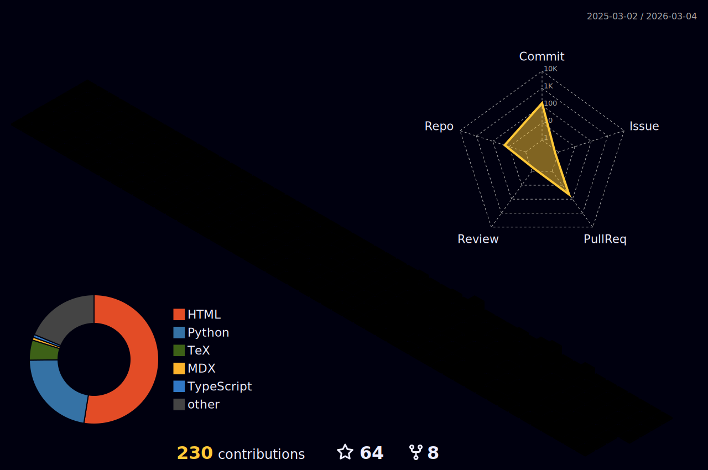

- [Domini's blog](https://dominicusin.github.io/)

- [Domini's keybase](https://dominicusin.keybase.pub/)

## :chart_with_upwards_trend: Statistics

<!--
### Hi there 👋

**dominicusin/dominicusin** is a ✨ _special_ ✨ repository because its `README.md` (this file) appears on your GitHub profile.

Here are some ideas to get you started:
​
- 🔭 I’m currently working on ...
- 🌱 I’m currently learning ...
- 👯 I’m looking to collaborate on ...
- 🤔 I’m looking for help with ...
- 💬 Ask me about ...
- 📫 How to reach me: ...
- 😄 Pronouns: ...
- ⚡ Fun fact: ...
-->

