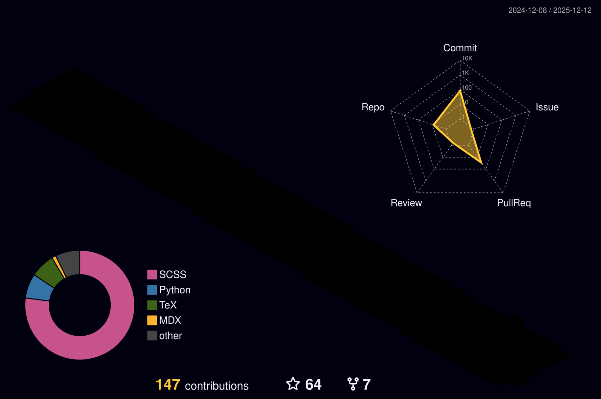
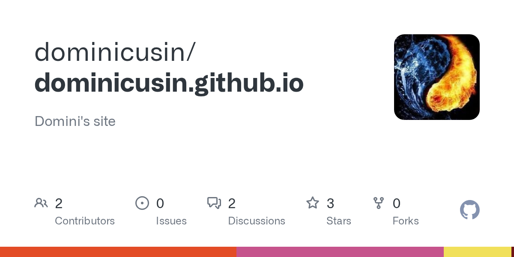
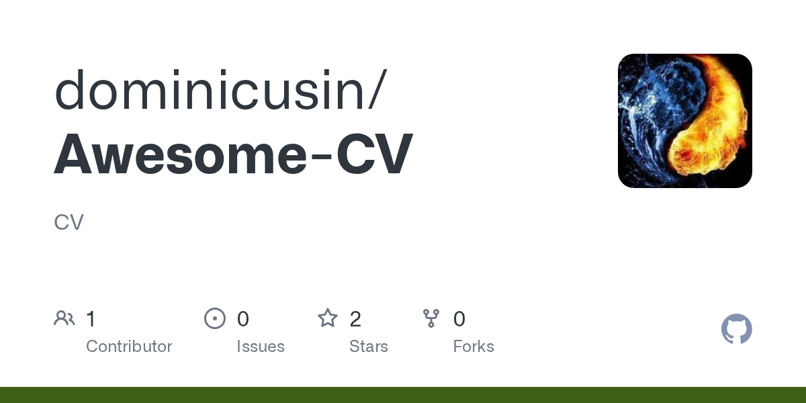
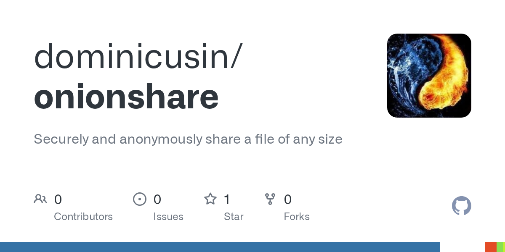

# 🎉 Hello — I'm Dominicusin ✨

  

  

---

## ✨ A little about me
I develop, experiment with tools and infrastructure, and share my findings on my blog. This page highlights my public projects, recent posts and ways to get in touch.

- Name: Dominicusin  
- Roles: Developer • Researcher • Blogger  
- Location: Online 🌐

---

## 🚀 Stats & languages

  
  &nbsp;
  

---
<!--
## 🧾 Featured projects
<table>
  <tr>
    <td align="center" width="33%">
      
       
      <strong><a href="https://github.com/dominicusin/dominicusin.github.io">dominicusin.github.io</a></strong>
      
Domini's site - Personal blog and portfolio showcasing articles, experiments and technical notes.

      

        
        
      

    </td>
    <td align="center" width="33%">
      
       
      <strong><a href="https://github.com/dominicusin/Awesome-CV">Awesome-CV</a></strong>
      
Professional CV template created with LaTeX for modern and elegant resume design.

      

        
        
      

    </td>
    <td align="center" width="33%">
      
       
      <strong><a href="https://github.com/dominicusin/onionshare">onionshare</a></strong>
      
Securely and anonymously share a file of any size using Tor network for privacy-focused file sharing.

      

        
        
      

    </td>
  </tr>
</table>

---
-->

## 📰 Latest blog posts

<!-- BLOG-POST-LIST:START -->
- **[YA movies's list](https://dominicusin.github.io/2025/11/yet-another-list-of-movies/)** — *Nov 2, 2025*
  Curated collection of films including "Greener Grass" (2019), "Mulholland Dr." (2001), "Se7en" (1995), and others spanning diverse genres and artistic styles.

- **[Unrestricted AI Tools](https://dominicusin.github.io/2025/10/unrestricted-ai-tools/)** — *Oct 30, 2025*
  Curated list of AI content generators that do not have any NSFW restrictions featuring platforms for generative image and video creation.

- **[Epistula ad Programmatorum](https://dominicusin.github.io/2025/10/epistula-ad-programmatorum/)** — *Oct 20, 2025*
  Philosophical meditation on programming through a Stoic lens, exploring virtue, rational thought, and error handling as spiritual practice rather than mere technical work.

- **[λογική (Logiki)](https://dominicusin.github.io/2025/10/logiki/)** — *Oct 14, 2025*
  Comprehensive examination of multiple logical systems beyond classical deduction, including abductive, dialectical, and fuzzy logic approaches adapted to various domains.
<!-- BLOG-POST-LIST:END -->

---

## 🛠 Skills & tools

### Programming Languages

### Development Tools

### CI/CD & DevOps

### Web Technologies

### Databases

### Testing & Quality

---

## ✉ Contact
- GitHub: https://github.com/dominicusin  
- GitLab: https://gitlab.com/dominicusin  
- LinkedIn: https://www.linkedin.com/in/dominicusin/  
- Keybase: https://keybase.io/dominicusin

---

